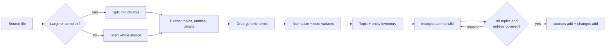

# Source Preprocessing, Topic Inventory & Entity Extraction

Before raw source material becomes wiki content, **preprocess each source file** to capture what it actually covers and what makes it distinct. The two required preprocessing artifacts are a **topic inventory** and an **entity list**. Together they anchor source incorporation so the wiki keeps the concrete, searchable, actionable details users come looking for — instead of collapsing source material into generic prose or a navigation skeleton.

## Why preprocess sources

Compression loses information by design. Without a checklist of what matters, source topics and specific, high-value terms (a metric name, a tool, a version number, an owning team) are exactly what get summarized away — and those are often what users search for or need to act correctly. A topic inventory and entity list, generated per source, give you:

- **A coverage checklist** — every substantive topic and discriminating entity should survive into the wiki as content, a page, a section, a tag, or a link.
- **Traceability** — you can verify each source's core topics are represented before marking it used (`sources add`).
- **Taxonomy and tagging input** — recurring entities across sources surface candidate categories, tags, and controlled-vocabulary terms (see [03-taxonomy-and-metadata.md](03-taxonomy-and-metadata.md)).
- **Findability** — concrete entities are the strongest search and synonym signals (see [06-search-and-findability.md](06-search-and-findability.md)).
- **Completion discipline** — a first-pass IA or table of contents is not done until the source topics and details are represented or explicitly tracked as follow-up work.

## Final-version target

Source preprocessing exists to support a final-version wiki, not only a core usable draft. Unless the user explicitly asks for an MVP, scaffold, outline, sample, or "core usable" version, the coverage plan should aim for complete source incorporation: main topics, entities, rules, examples, warnings, exceptions, thresholds, and procedures are either covered, explicitly excluded, or tracked as deferred work.

Core usability is an intermediate milestone, not a completion label. If preprocessing shows that meaningful chunks or topics remain uncovered, the result must be described as partial incorporation and the uncovered work must remain visible in the coverage matrix and final response.

## Copyrighted and likely copyrighted sources

When the source is a copyrighted or likely copyrighted book, article, manual, paid course, or similar long-form work, inventory and incorporate the knowledge without reproducing the source's expressive text.

The goal is knowledge retention, not a thin abstract. For book-like and reference-like sources, extract enough main knowledge that readers can use the wiki for ordinary understanding, decisions, and action without reopening the original book. Copyright-aware transformation limits copied expression; it does not lower the expected coverage of concepts, rules, procedures, warnings, exceptions, thresholds, and other substantive knowledge.

During preprocessing, extract the learned knowledge at a useful reader-facing level:

- **Concepts and definitions** in normalized wiki vocabulary, not copied phrasing.
- **Taxonomies and relationships** such as categories, stages, causes, dependencies, and comparisons.
- **Decision rules, thresholds, warnings, exceptions, and procedures** as transformed checklists, tables, or decision trees.
- **Examples and cases** as generalized scenarios that preserve the lesson without copying distinctive narrative details.
- **Useful source-specific facts** that are necessary for action, attribution, or searchability.

Do not copy large passages, reconstruct chapters in the original sequence and language, or make the wiki a substitute version of the book. Short quotations are allowed only when necessary for precision and should remain minimal and attributed.

Copyright-aware transformation should reduce copied expression, not source coverage. Keep important actionable knowledge in transformed form, and use the coverage matrix to mark any item that cannot be included because it would require excessive verbatim reproduction.

## What a topic inventory is

For each source file, list the **substantive topics** the source covers. Capture the topics at the level a reader would expect to find in the wiki, not only the broad category. Include:

| Topic category | Examples |
|---|---|
| **Headings and subheadings** | Chapter topics, section topics, repeated source labels |
| **Workflows and procedures** | Step-by-step processes, maintenance routines, response flows |
| **Decision points and rules** | If/then criteria, eligibility rules, escalation rules, prioritization logic |
| **Thresholds and measurements** | Ranges, limits, timing, quantities, scoring rules, service levels |
| **Warnings, exceptions, and caveats** | Contraindications, edge cases, risks, common mistakes, uncertainty notes |
| **Examples and scenarios** | Cases, templates, sample configurations, user situations, before/after patterns |
| **Recurring questions or problems** | FAQ-like issues, troubleshooting themes, repeated pain points |

Topic inventory is intentionally broader than entity extraction. If a source has an important unnamed concept, workflow, warning, or example, it still belongs in the topic inventory even if it is not a named entity.

## What an entity list is

For each source file, list the **discriminating named entities** in the grounding — the specific, named things that distinguish this source from any other. Capture these categories:

| Entity category | Examples |
|---|---|
| **People / IDs** | Names, aliases, owners, author handles, ticket/case IDs, request numbers |
| **System / group names** | Services, components, owning teams, distribution lists, environments |
| **Tools** | Applications, CLIs, libraries, dashboards, scripts referenced |
| **Programs** | Initiatives, projects, processes, named workflows |
| **Metrics** | KPIs, SLAs, thresholds, named measurements |
| **Version numbers** | Releases, build numbers, API versions, dates that act as versions |

## What to exclude

**Exclude ubiquitous generic terms** that appear by default across nearly every source and therefore **don't discriminate** between them:

- The **product name itself** (the thing the whole wiki is about).
- The **host platform** (e.g. the wiki/KB system, the cloud or OS everything runs on).
- **Structural filler words** like "Article", "Knowledge", "Page", "Document", "Overview" that describe the container, not the content.
- Generic role/words that match almost any page ("user", "team", "system") **unless** they are part of a specific named entity.

> Test for inclusion: *"If I searched the whole source folder for this term, would it narrow results to a meaningful subset?"* If yes, it discriminates — keep it. If it returns almost everything, drop it.

## How to generate the preprocessing inventory

For each source file in the source folder:

1. **Read or segment the source** (record it with `sources add` once incorporated; see [wiki_tools.md](wiki_tools.md)).
2. **Create a topic inventory** from headings, structure, recurring themes, workflows, rules, examples, warnings, thresholds, and questions.
3. **Scan for named entities** across the six entity categories above.
4. **Filter out** the ubiquitous generic terms using the inclusion test.
5. **Normalize** each topic and entity to one canonical form, noting variants/synonyms (feeds controlled vocabulary in [03-taxonomy-and-metadata.md](03-taxonomy-and-metadata.md)).
6. **Record the inventory** keyed to the source file — store it alongside wiki metadata (e.g. in the `.wiki` folder) so it persists and can be reviewed.
7. **Create or update a coverage matrix** that maps each inventory item to a wiki destination, explicit exclusion, or tracked follow-up before calling the source incorporated.

## Large or complex source handling

When a source is long, noisy, OCR-derived, heterogeneous, or too large to cover reliably in one pass, **split before writing**. Treat a source as large or complex when it is over roughly 1,000 lines, contains multiple chapters, is a book/manual/reference, mixes many topics, or would require readers to act from detailed rules. Good split boundaries include source file, chapter, heading range, page range, transcript segment, appendix, or semantic topic cluster.

For each chunk, extract:

- **Topics and subtopics** covered in the chunk.
- **Discriminating entities** and their variants.
- **Useful details** such as rules, thresholds, procedures, examples, warnings, exceptions, caveats, and actionable links.
- **Suggested wiki destinations** such as existing page, new page, section, metadata/tag, or follow-up task.
- **Uncertainty notes** for OCR errors, missing context, conflicting statements, or ambiguous source structure.

If subagents are available, use them for bounded read-only extraction tasks on separate chunks or source files. Ask each subagent to return the same extraction schema above. Then merge the outputs before final writing: de-duplicate repeated topics, normalize names, reconcile conflicts by preserving both views when needed, and build one coverage plan. Do not let subagent summaries replace the merge step; the final wiki pages should be based on the combined inventory.

Do not replace chunk extraction with a whole-source summary. If the task budget is not enough to incorporate all chunks, record the uncovered chunks as deferred work and describe the result as partial incorporation, not a completed wiki.

## Using the inventory during wiki generation

When incorporating sources into wiki pages, treat the topic inventory and entity list as the **acceptance criteria** for that source:

- **Cover every substantive topic.** Each topic should appear as page content, a page, a section, a link target, metadata, or an explicitly tracked follow-up with a reason. If a topic is missing, add it back or explain why it was excluded.
- **Cover every discriminating entity.** Each entity should appear in the wiki content, as a tag, or as a link target. If one is missing, the wiki dropped a core searchable detail — add it back.
- **Preserve useful details.** Rules, thresholds, procedures, examples, caveats, warnings, exceptions, and actionable links should be retained unless duplicate, irrelevant, obsolete, privacy-sensitive, or explicitly excluded by the user.
- **Drive page metadata.** Promote recurring entities into `tags` and into the page's `description`, and keep the `sources` frontmatter pointing at the originating file (see SKILL.md metadata rules).
- **Seed taxonomy and synonyms.** Topics that recur across many sources are candidate categories/facets; entity variants become search synonyms.
- **Verify before closing the loop.** Only mark a source used (`sources add`) once its substantive topics and discriminating entities are represented or explicitly accounted for; log the edit with `changes add`, then `wiki_tools build`.

## Coverage check

Before calling a source incorporated, create or update a persisted coverage matrix under `.wiki/`, such as `.wiki/source-coverage.md` or `.wiki/source-inventories/<source-name>.md`:

| Source | Chunk / Section | Inventory Item | Type | Wiki Destination | Status | Reason |
|---|---|---|---|---|---|---|
| path | chapter/page/heading | topic/entity/detail | topic/entity/rule/example/warning | page/section/tag/follow-up | Covered/Deferred/Excluded | one-line reason |

Use `Deferred` only for genuine incremental work that remains visible in the user's final response or wiki maintenance to-do list. Do not treat a structure-only first pass as complete source incorporation unless the user explicitly asked for an outline or scaffold.

If a coverage item is missing from the wiki and has no exclusion or deferral reason, the source incorporation is not done. Do not run `sources add` merely because a source was read or summarized; record it as used only after substantive inventory items are covered or explicitly accounted for.

## Completion language

Use completion labels that match the evidence from the coverage matrix:

- **Scaffold created** — IA, navigation, parent pages, or sample pages exist, but source coverage has not been completed.
- **Partial incorporation** — some sources, chapters, chunks, or topic groups are incorporated, but meaningful source material remains.
- **Source-covered wiki** — every substantive inventory item is covered, explicitly excluded, or tracked as deferred work.

Do not call a wiki complete, comprehensive, or fully built from sources unless the coverage matrix supports that claim.

## Anti-patterns

- **Listing everything without judgment.** An inventory full of generic terms is noise; if an entity doesn't discriminate, it doesn't belong. For topics, prefer substantive reader-facing topics over every repeated filler phrase.
- **Including the product/platform name** as an entity — it's true of every source and helps no one find anything.
- **Generating the inventory but not checking against it** — the inventory only adds value if wiki pages are validated against it.
- **Stopping at the IA.** A useful structure is not the same as source coverage; pages still need the source's substantive topics and useful details.
- **Letting large sources collapse into a thin summary.** Split them, extract by chunk, and merge the results.
- **Delegating without synthesis.** Subagent outputs are extraction inputs, not final coverage proof; merge and verify them before writing or closing the task.
- **One-time use.** Regenerate or update a source's preprocessing inventory when `staleness-check` flags the source as new or changed.
