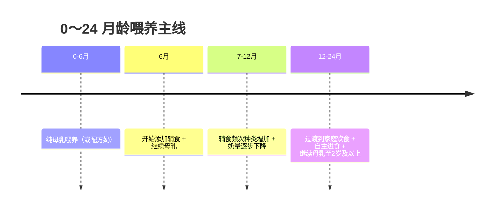

# 喂养与营养

充足的营养和良好的喂养是婴幼儿体格生长、器官成熟和大脑发育的基础，也为一生的健康饮食习惯打下根基。

## 本节内容

- [[母乳喂养]] — 优点、含乳姿势、判断吃饱、常见障碍
- [[配方奶喂养]] — 何时需要、选择与冲调、喂养量
- [[辅食添加]] — 时间、原则、种类、性状进阶、频次
- [[维生素与营养素补充]] — 维生素D、铁、DHA、补钙迷思
- [[饮食习惯与自主进食]] — 回应式喂养、自主进食、油盐标准
- [[常见喂养问题]] — 溢奶、拒奶瓶、乳头混淆、母乳不足与过多、胃食管反流

## 喂养阶段速览

## 关键原则

- **0～6 个月**提倡纯母乳喂养，不需额外加水或其他食物。
- **满 6 个月**起添加辅食（早产儿按矫正月龄 4～6 月），可继续母乳到 2 岁及以上。
- 出生后**尽早开奶**、皮肤接触、按需哺乳，每日 8～10 次以上。
- 辅食**每天不少于 4 类**，至少含一种动物性食物、一种蔬菜、一种谷薯类。
- **1 岁以内辅食不加盐、糖和调味品**，保持原味。

详见各子页面。
